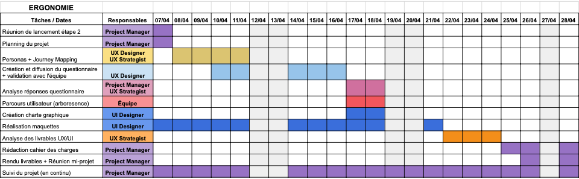

# SAE203 - Site de réservation

## Introduction

Dans le cadre de notre SAÉ, nous avons été chargés de concevoir une application web de gestion de réservations de matériel et de salles au sein du département MMI de Meaux. Ces réservations sont gérées manuellement via des fichiers Excel ou des documents partagés, ce qui engendre de nombreuses contraintes : lenteur, erreurs possibles, mauvaise visibilité de la disponibilité des ressources, etc.

L'objectif de ce projet est de concevoir une solution numérique centralisée, sécurisée, accessible et ergonomique, qui permette de :

_- Gérer les inscriptions et les connexions avec différents rôles (étudiants, enseignants, agents, administrateurs)_ 
_- Effectuer des réservations de matériels ou de salles_ 
_- Gérer et valider les réservations par les agents et les administrateurs_ 
_- Suivre l’historique des réservations et générer des documents justificatifs_ 
_- Proposer des statistiques de réservation_

Notre projet s’est construit autour de la mise en place d’un site web complet, respectant les standards de développement actuels (HTML, CSS, PHP, MySQL, etc...) et des exigences fonctionnelles précises.

## Présentation de l'équipe

-   GBADAGNI Soumiyya - **Chef de projet, Développeur**
-   JANVIER Charly - **Designer UI, Développeur**
-   LEBRETON Laura - **Designer UX, Développeur**

## Planning Ergonomie

## Planning Front / Back End

|            **Semaine**            |                                                                  **Tâches principales**                                                                   |                     **Responsables**                      |
| :-------------------------------: | :-------------------------------------------------------------------------------------------------------------------------------------------------------: | :-------------------------------------------------------: |
|  **Semaine 1 21 - 27 avril**   |            - Prise de connaissance du cahier des charges - Répartition des rôles - Création de la DB - Début du header et du menu nav            |                           Tous                            |
| **Semaine 2 28 avril - 4 mai** | - Page d’inscription (formulaire, validations, hash) - Page de connexion (session, redirection) - Intégration initiale base de données utilisateurs |        Soumiyya (inscription), Charly (connexion)         |
|    **Semaine 3 5 - 11 mai**    |                 - Page salles et réservation salles (formulaire, affichage) - Affichage des réservations en cours dans un calendrier                  |              Laura (salles), Charly (réservations / calendrier)              |
|   **Semaine 4 12 - 18 mai**    |                  - Pages matériel et réservation matériel (formulaire, affichage) - Création du profil utilisateur                  |  Soumiyya (matériel), Charly (profil)  |
|   **Semaine 5 19 - 24 mai**    |           - Génération du PDF de réservation - Page liste des utilisateurs (vue admin) - Finitions : responsive, erreurs, messages, tests           | Charly (PDF, liste), Soumiyya (corrections / test) |

## Bilan

Ce projet nous a permis de mettre en pratique de nombreux aspects du développement web full-stack, tels que : 
_- La conception de formulaires sécurisés avec validations serveur et client_ 
_- La gestion des sessions et des rôles utilisateurs_ 
_- L’utilisation d’une base de données relationnelle_ 
_- La génération de fichiers PDF dynamiques_ 
_- L’organisation du travail en équipe avec répartition claire des tâches_ 

## Ce que nous avons appris :

_- Comment créer une application structurée avec différents niveaux d’accès_ 
_- Séécurisation des données utilisateurs (notamment le hachage des mots de passe)_ 
_- Travailler en collaboration avec Git et organiser notre code_ 
_- Utiliser des bibliothèques ou outils comme FPDF, calendrier JS, ou Bootstrap pour accélérer le développement_ 

## Difficultés rencontrées :

_- Gestion des sessions et redirections selon le rôle_ 
_- Intégration du calendrier et synchronisation avec les réservations_ 
_- Insertion des images dans la base de données_ 
_- Génération du PDF avec les bonnes données au bon moment_ 
_- Quelques problèmes de compatibilité CSS entre navigateurs_ 
_- Différences d’affichage selon les ordinateurs_ 
